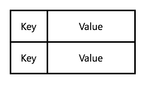
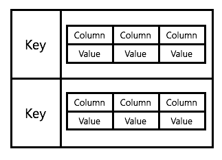
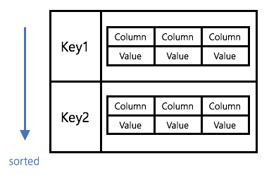
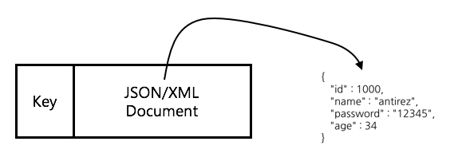
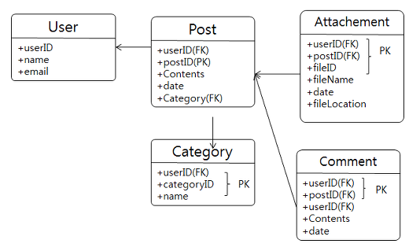
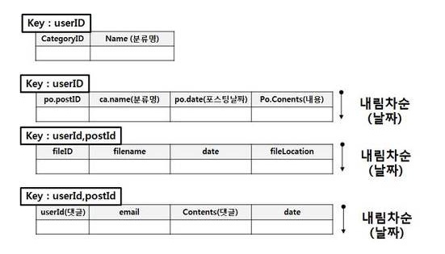
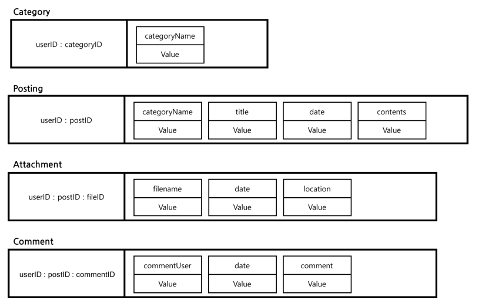
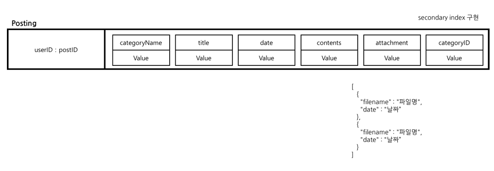

기존 RDBMS 데이터 모델링 관점에서 NoSQL 모델링을 접근하면 많은 문제를 유발한다.
NoSQL은 같은 데이터베이스이지만, 전혀 다른 성격을 가지고 있고, 접근 방식이 틀리다.

## NoSQL 데이터 모델 패턴

모델링 설계에 앞서 NoSQL이 어떤 구조로 데이터를 저장하는지 이해할 필요가 있다. 3가지 패턴으로 구분된다.

### 1. Key/Value Store

가장 기본적인 패턴으로 이 패턴을 흔히 NoSQL이라고 생각한다. 유니크한 Key에 하나의 Value를 저장하는 방식이다.



Value는 일반적으로 primitive 타입을 사용할 수 있지만, 테이블 형태의 데이터를 저장할 수 없기 때문에, 조금 확장된 개념을 사용하는데, Column Family라는 개념을 사용한다. Key 안에 Column과 Value 조합으로 된 여러개의 필드를 갖는데, 이를 Column Family라고 한다.



> Redis에서는 Hashs 오브젝트가 유사하다.

```shell
@cli
redis> HMSET user:1000 username antirez password P1pp0 age 34
OK
redis> HGETALL user:1000
1) "username"
2) "antirez"
3) "password"
4) "P1pp0"
5) "age"
6) "34"
redis> HSET user:1000 password 12345
(interger) 0 # 0은 update의 의미, 1은 add new value
redis> HGETALL user:1000
1) "username"
2) "antirez"
3) "password"
4) "12345"
5) "age"
6) "34"
```

### 2. Ordered Key/Value store

위 패턴의 확장된 형태로 저장 방식은 동일하나 데이터가 내부적으로 key를 순서로 sorting되서 저장한다.



> Redis에서는 Sorted Sets 오브젝트가 유사하다.

> Column이 float 한정으로 score라는 용어로 사용

```shell
redis> ZADD myzset 1 "one"
(integer) 1
redis> ZADD myzset 1 "uno"
(integer) 1
redis> ZADD myzset 2 "two" 3 "three"
(integer) 2
redis> ZRANGE myzset 0 -1 WITHSCORES
1) "one"
2) "1"
3) "uno"
4) "1"
5) "two"
6) "2"
7) "three"
8) "3"
```

### 3. Document Key/Value Store

key/Value Store의 확정된 형태로, 저장되는 Value의 데이터 타입이 XML, JSON, YAML과 같은 구조화된 데이터 타입으로 복잡한 계층 구조를 표현할 수 있다.



> Redis에서는 추가적인 모듈이 필요하다.

> rejson !

> redis module labs에서 제공한다.

https://redislabs.com/blog/redis-as-a-json-store/

https://github.com/redislabsmodules/rejson

docker로 테스트 진행

```shell
$ docker run -d -p 6379:6379 --name redis-rejson redislabs/rejson:latest

$ redis-cli
127.0.0.1:6379> JSON.SET scalar . '"Hello JSON!"'
OK
127.0.0.1:6379> JSON.SET object . '{"foo": "bar", "ans": 42}'
OK
127.0.0.1:6379> JSON.GET object
"{"foo":"bar","ans":42}"
127.0.0.1:6379> JSON.GET object .ans
"42"
```

## NoSQL 데이터 모델링

NoSQL의 특성이 기존의 RDBMS와는 매우 다르므로 접근 방법을 바꿔야한다.

### NoSQL과 RDBMS의 데이터 모델링 차이

RDBMS 모델링의 근본 사상 2가지를 바꿔야한다.

1. 개체 모델 지향에서 쿼리 결과 지향 모델링

  RDBMS의 모델링 기법은 저장하고자하는 도메인 모델을 먼저 분석한 후에, 개체간의 관계를 식별하고, 테이블을 추출해내고, 테이블을 이용하여 쿼리를 구현하여 결과를 뽑아내는 방식이다.

  NoSQL은 이 접근 방법을 역순으로 진행해야한다.

  도메인 모델 > [쿼리 결과 > 테이블] 순서로 테이블을 디자인해야 한다.

  NoSQL의 경우 복잡한 쿼리 기능이 없기 때문에, 반대로 도메인 모델에서 어떤 쿼리 결과가 필요한지 정의한 후에, 이 쿼리 결과를 얻기 위한 데이터 저장 모델을 역순으로 디자인해야한다.

2. 정규화에서 비정규화

  RDBMS 모델링에서는 데이터의 일관성과 도메인 모델과의 일치성을 위해 데이터 모델을 정규화한다. 같은 데이터가 2개의 테이블에 중복 저장되는 것을 제거하는데, NoSQL은 반대의 접근 방법이 필요하다.

  쿼리의 효율성을 위해 데이터를 정규화하지 않고, 의도적으로 중복된 데이터를 저장하는 등의 비정규화된 데이터 모델 설계 방식으로 접근해야한다.

### NoSQL 테이터 모델링 절차

1. 도메인 모델 파악

  NoSQL도 마찬가지로 ERD를 그려서 도식화한다. 이렇게 하지 않고 바로 애플리케이션의 관점에서 접근하는 방식도 있으나, NoSQL 역시 데이터베이스이며, 저장할 데이터에 대한 명확한 이해는 반드시 필요하다.

  간단한 블로그 시스템의 데이터 도메인 모델이다.

  이 블로그는

  * 사용자 ID 기반으로 블로그의 분류(Category)를 가지고 있고,
  * 분류별로 글을 작성할 수 있으며,
  * 글에 파일을 첨부할 수 있고,
  * 댓글을 달 수 있는 블로그이다.

  

2. 쿼리 결과 디자인

  다음으로 가장 중요한 과정인 쿼리 결과 디자인이다. 애플리케이션에 의해서 쿼리되는 결과값을 먼저 정해야한다.

  * 전체 분류 출력

    ```sql
    select categoryID, name from Category where userID='사용자ID'
    ```

  * 포스팅의 분류, 제목, 날짜, 본문 출력

    ```sql
    select po.postID, po.Contents, po.date, ca.name
    from Category ca, Post po
    where userID='사용자ID'
    order by date desc
    ```

  * 첨부 파일 출력

    ```sql
    select fileID, filename, date, fileLocation
    from Attachment
    where userID='사용자ID' and postID='현재 포스팅 ID'
    order by date desc
    ```

  * 댓글 출력

    ```sql
    select userID, email, Contents, date
    from Comment
    where userID='사용자ID' and postID='현재 포스팅 ID'
    order by date desc
    ```

  4개 정도의 쿼리가 필요하다고 정의하자. 출력은 아래와 같이 될 것이다.

  

3. 패턴을 이용한 데이터 모델링

  NoSQL은 Sorting, Grouping, Join 등의 RDBMS 기능을 제공하지 않기 때문에 이를 배제하고 PUT/GET으로만 데이터를 가지고 올 수 있는 형태로 테이블을 재정의해야한다.

  이 때 가장 중요한 것은 비정규화이다. 데이터를 가급적 중복으로 저장하여, 한번에 데이터를 읽어오는 횟수를 줄이도록 한다.

  

  Key 부분을 주목해 볼 필요가 있는데, Join을 없애기 위해서, userID나 postID를 :으로 구분되는 deliminator로 하여 Key에 포함시켜 버렸다.

  이것 외에도 다른 이유가 있는데, Ordered Key/Value Store의 경우에는 Key를 기반으로 소팅을 하기 때문에 첫번째, 포스트 ID를 sequential 하게 증가 시켜나가면, 같은 사용자의 글의 경우에는 Sorting이 가능하다.

  또 다른 이유는 Grouping인데, 포스팅을 출력하는 사용자에 대해서 posting을 쭉 입력해 나가면, 순차적으로 Post가 출력이 되다가, 해당 사용자의 포스팅 데이터가 끝이나면, Key의 맨 앞 userID가 다른 사용자 ID로 바뀌기 떄문에 where 문장 없이도 특정 사용자의 포스팅을 순차적으로 출력할 수 있다. Enumerable Key와 Composite Key Index 패턴을 참고

4. 최적화를 위한 필요한 기능들을 리스팅

  첨부파일의 경우에는 포스팅이 작성되었을 때 레코드가 추가되며, 변경이 거의 없다. 그리고 첨부 파일의 수는 그리 많지 않기 때문에, 하나의 필드에 모두 몰아서 저장할 수 있다.

  그리고 블로그 포스트, 첨부파일, 댓글은 Sorting이 되어야 하기 때문에, Ordered Key 형태가 필요하다.

  현재 데이터 모델은 포스팅이 포스트된 순서대로만 출력하는 형태인데, 분류 개념이 있기 때문에, 분류에 따라서 포스팅을 출력하려면 분류 필드가 별도 필드로 들어가야하고, 이 필드에 따라 where문으로 select 할 수 있는 기능이 있어야 한다. RDBMS의 Index 같은 개념이 필요한데, 이러한 기능을 NoSQL에서는 Secondary Index라고 한다.

  

  > redis에서는 Sorted Set으로 구현할 수 있다.

  > https://redis.io/topics/indexes

5. redis에서 구현

  ```shell
  # date set
  HMSET user:1000:1 categoryName IT
  HMSET user:1000:2 categoryName Daily

  HMSET user:1000:P0001 categoryName IT title 'NoSQL Modeling' date '2018-03-14:09:10:20' contents 'NoSQL Modeling is very difficult.' attachment '[]' categoryID 1
  ZADD user:1000:category.index 1 P0001
  ZADD user:1000:time.index 1521080087 P0001

  HMSET user:1000:P0002 categoryName Daily title 'Post to watch Black Panther' date '2018-03-15:12:30:10' contents 'Wakanda is very smart!'
  attachment '[]' categoryID 2
  ZADD user:1000:category.index 2 P0002
  ZADD user:1000:time.index 1521080201 P0002

  HMSET user:1000:P0003 categoryName IT title 'Spring, Redis and Jedis' date '2018-03-17:09:00:05' contents 'Jedis is redis for Java.' attachment '[]' categoryID 1
  ZADD user:1000:category.index 1 P0003
  ZADD user:1000:time.index 1521080482 P0003

  # IT에 관한 글을 보고 싶을 때
  ZRANGEBYSCORE user:1000:category.index 1 1
  1) "P0001"
  2) "P0003"

  # P0001 포스트 객체 확인
  HGETALL user:1000:P0001
   1) "categoryName"
   2) "IT"
   3) "title"
   4) "NoSQL Modeling"
   5) "date"
   6) "2018-03-14:09:10:20"
   7) "contents"
   8) "NoSQL Modeling is very difficult."
   9) "attachment"
  10) "[]"
  11) "categoryID"
  12) "1"

  # 3월 14일부터 3월 15일까지 쓴 포스트 확인
  ZRANGEBYSCORE user:1000:time.idex 1521080000 1521080400
  1) "P0001"
  2) "P0002"
  ```
